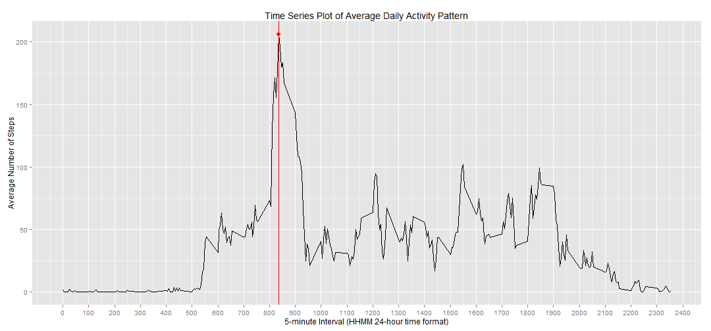
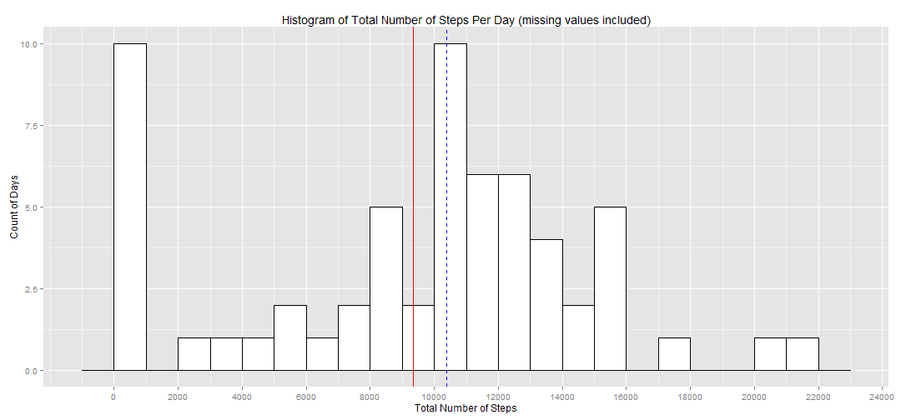
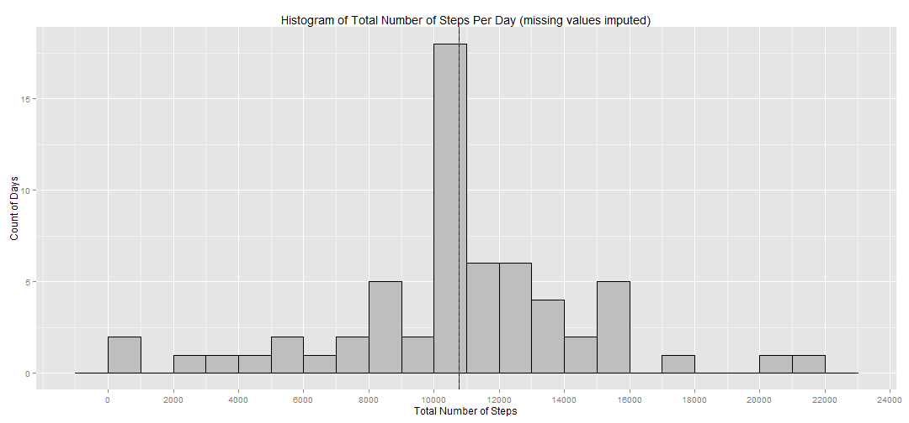
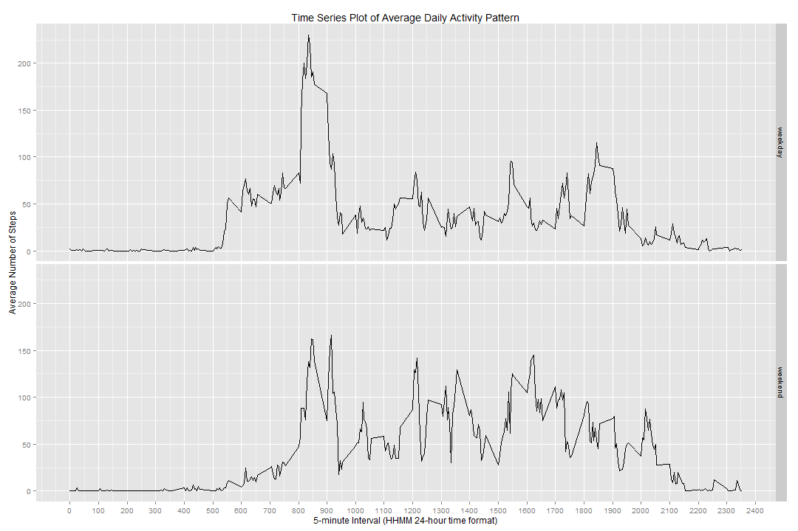

***

# Peer Assignment 1 of the Course Reproducible Research (Part of Coursera's John Hopkins University Data Science Specialization Series)
### by Stefan Schmager (May 17, 2015)

***

## Introduction

It is now possible to collect a large amount of data about personal movement using activity monitoring devices such as a [Fitbit](http://www.fitbit.com/#i.1o2cgzwhxieyux), [Nike Fuelband](http://www.nike.com/us/en_us/c/nikeplus-fuel), or [Jawbone Up](https://jawbone.com/up). These type of devices are part of the "quantified self" movement - a group of enthusiasts who take measurements about themselves regularly to improve their health, to find patterns in their behavior, or because they are tech geeks.  

This assignment makes use of data from a personal activity monitoring device.


## Data

This device collects data at 5 minute intervals through out the day. The data consists of two months of data from an anonymous individual collected during the months of October and November, 2012 and include the number of steps taken in 5 minute intervals each day.  

The data for this assignment can be downloaded from the course web site:

* __Dataset__: Activity monitoring data-- [repdata-data-activity.zip](https://d396qusza40orc.cloudfront.net/repdata%2Fdata%2Factivity.zip) [52K]

The variables included in this data set are:

* __Date__: Date on which the measurement was taken _(format: YYYY-MM-DD)_
* __Interval__: Identifier for the 5-minute interval in which measurement was taken _(fomat: HHMM with leading zeros removed; integer number)_
* __Steps__: Number of steps taking in a 5-minute interval _(format: integer number with missing values coded as NA)_

The data set is stored in a comma-separated-value (CSV) file and there are a total of 17,568 observations in this data set.


## Loading and preprocessing the data

Preliminary, a series of packages were loaded which will be utilized in the following analyses. 

```r
library(plyr)
library(dplyr)
library(ggplot2)
sessionInfo()
```

```
## R version 3.1.3 (2015-03-09)
## Platform: x86_64-w64-mingw32/x64 (64-bit)
## Running under: Windows 7 x64 (build 7601) Service Pack 1
## 
## locale:
## [1] LC_COLLATE=English_United States.1252 
## [2] LC_CTYPE=English_United States.1252   
## [3] LC_MONETARY=English_United States.1252
## [4] LC_NUMERIC=C                          
## [5] LC_TIME=English_United States.1252    
## 
## attached base packages:
## [1] stats     graphics  grDevices utils     datasets  methods   base     
## 
## other attached packages:
## [1] ggplot2_1.0.1 dplyr_0.4.1   plyr_1.8.2    knitr_1.10   
## 
## loaded via a namespace (and not attached):
##  [1] assertthat_0.1   colorspace_1.2-6 DBI_0.3.1        digest_0.6.8    
##  [5] evaluate_0.7     formatR_1.2      grid_3.1.3       gtable_0.1.2    
##  [9] htmltools_0.2.6  labeling_0.3     lazyeval_0.1.10  magrittr_1.5    
## [13] markdown_0.7.4   MASS_7.3-40      mime_0.3         munsell_0.4.2   
## [17] parallel_3.1.3   proto_0.3-10     Rcpp_0.11.5      reshape2_1.4.1  
## [21] rmarkdown_0.5.1  scales_0.2.4     stringr_0.6.2    tools_3.1.3     
## [25] yaml_2.1.13
```

The dataset was downloaded from the hyperlink above, unzipped, saved as _activity.csv_ and read into R. The columns were also arranged in a more logical order.

```r
DataSource  <- "https://d396qusza40orc.cloudfront.net/repdata%2Fdata%2Factivity.zip"
DataPlace   <- "C:/Users/Stefan/Google Drive/Coursera/04_Reproducible Research/ReproducibleResearch_PeerAssignment1"
TempFile <- tempfile()
DataFile    <- "activity.csv"
setwd(DataPlace)
download.file(url = DataSource, destfile = TempFile)
DownloadDate = date()
activity          <- read.csv(unz(TempFile, DataFile))
activity          <- select(activity, date, interval, steps)
```

The data types of each variable were defined.

```r
activity$steps    <- as.integer(activity$steps)
activity$date     <- as.Date(as.character(activity$date), format = "%Y-%m-%d")
activity$interval <- as.integer(activity$interval)
```


## Total number of steps taken per day

The total numbers of steps taken per day were calculated. Missing values were ignored and excluded from the computation. 
The top and bottom 5 rows of the resulting aggregated dataset are shown below.  

```r
TotalStepsPerDay  <- as.data.frame(summarize(group_by(activity, date),
                                            TotalSteps = sum(steps,na.rm = T)))
head(TotalStepsPerDay); tail(TotalStepsPerDay)
```

```
##         date TotalSteps
## 1 2012-10-01          0
## 2 2012-10-02        126
## 3 2012-10-03      11352
## 4 2012-10-04      12116
## 5 2012-10-05      13294
## 6 2012-10-06      15420
```

```
##          date TotalSteps
## 56 2012-11-25      11834
## 57 2012-11-26      11162
## 58 2012-11-27      13646
## 59 2012-11-28      10183
## 60 2012-11-29       7047
## 61 2012-11-30          0
```

```r
Mean              <- as.integer(round(mean(TotalStepsPerDay$TotalSteps), 0))
Median            <- as.integer(round(median(TotalStepsPerDay$TotalSteps), 0))
```

On average, __9354 steps (mean)__ were taken each day. On half of the days during the given time frame, more than __10395 steps (median)__ were taken. 
A histogram of the total number of steps taken each day is shown below. It also includes the mean (red solid line) and median (blue dashed line).  


```r
hist1 <- ggplot(TotalStepsPerDay,
                aes(x=TotalSteps)) +
      geom_histogram(binwidth=1000, colour="black", fill="white") +
      geom_vline(aes(xintercept=Mean), color="red", linetype = "solid", size = .5) + 
      geom_vline(aes(xintercept=Median), color="blue", linetype = "dashed", size = .5) +
      labs(title = "Histogram of Total Number of Steps Per Day (missing values included)",
           y = "Count of Days",
           x = "Total Number of Steps") +
      scale_x_continuous(breaks=seq(0, 25000, 2000))
hist1
```

 


## Average daily activity pattern

The average daily activity pattern was computed and subsequently visualized in a time-series plot.

```r
AverageStepsPerInterval <- as.data.frame(summarize(group_by(activity, interval),
                                                   AverageSteps = mean(steps,na.rm = T)))
Max <- AverageStepsPerInterval[
       AverageStepsPerInterval$AverageSteps == max(AverageStepsPerInterval$AverageSteps),]

ggplot(data=AverageStepsPerInterval,
       aes(x=interval, y=AverageSteps, type = "l")) +
      geom_line() +
      geom_vline(aes(xintercept = Max[1,1]), color="red", linetype = "solid", size = .5) +
      labs(title = "Time Series Plot of Average Daily Activity Pattern",
           x = "5-minute Interval (HHMM 24-hour time format)",
           y = "Average Number of Steps") +
      scale_x_continuous(breaks=seq(0, 2400, 100)) +
      geom_point(x = Max[1,1], y = Max[1,2], colour = "red", size = 3)
```

 

```r
Max <- AverageStepsPerInterval[
       AverageStepsPerInterval$AverageSteps == max(AverageStepsPerInterval$AverageSteps),]
```

On average across all days in the data set, the __"835" 5-minute interval__ accounts for the __maximum number of steps (circa 206)__.


## Imputing missing values

Note that there are a number of day-interval observations in the dataset with missing values in the steps column (coded as NA). The first five rows of the dataset exemplify that.

```r
NAs1 <- sum(is.na(activity$steps))
head(activity, 5)
```

```
##         date interval steps
## 1 2012-10-01        0    NA
## 2 2012-10-01        5    NA
## 3 2012-10-01       10    NA
## 4 2012-10-01       15    NA
## 5 2012-10-01       20    NA
```

The original data sets contains __2304 rows with NAs)__, that is 13% of the whole dataset and a significant gap.
The presence of missing values may introduce bias into some calculations or summaries of the data.
Therefore, a strategy for filling in all of the missing values in the data set is applied; the NA steps of a day-interval observation were replaced by the average steps of that particular 5-minute interval across all days.

```r
activity_noNAs    <- join(activity, AverageStepsPerInterval, by = "interval")

activity_noNAs$steps[         which(is.na(activity_noNAs$steps))] <- 
activity_noNAs$AverageSteps[  which(is.na(activity_noNAs$steps))]

activity_noNAs$AverageSteps <- NULL

NAs2              <- sum(is.na(activity_noNAs$steps))
```

As a result, a new data set is created, which is equivalent to the original data set but with the missing data filled in. The number of missing values now equals 0.

A comparable histogram of the total number of steps taken each day was re-created. The mean and median of the total number of steps taken per day were re-calculated as well.

```r
TotalStepsPerDay_noNAs  <- as.data.frame(dplyr::summarize(group_by(activity_noNAs, date),
                                                         TotalSteps = sum(steps)))

Mean_noNAs              <- as.integer(round(mean(TotalStepsPerDay_noNAs$TotalSteps), 0))
Median_noNAs            <- as.integer(round(median(TotalStepsPerDay_noNAs$TotalSteps), 0))

hist2 <- ggplot(TotalStepsPerDay_noNAs,
                aes(x=TotalSteps)) + 
      geom_histogram(binwidth=1000, colour="black", fill="grey") + 
      geom_vline(aes(xintercept=Mean_noNAs), color="red", linetype = "solid", size = .5) + 
      geom_vline(aes(xintercept=Median_noNAs), color="blue", linetype = "dashed", size = .5) +
      labs(title = "Histogram of Total Number of Steps Per Day (missing values imputed)",
           y = "Count of Days",
           x = "Total Number of Steps") +
      scale_x_continuous(breaks=seq(0, 25000, 2000))

hist1; hist2
```

  

If one compares the histograms and measures of tendency with the ones shown before, a difference can be noticed. Imputing missing data on the estimates of the total daily number of steps has
* equalized mean and median and 
* approached the distribution of the total number of steps per day close to a normal distribution

__Measure of Central Tendency__|__Value w/ NAs__|__Value w/o NAs__
-------------------------------|----------------|-----------------
Mean                           | 9354       | 10766
Median                         | 10395     | 10766


## Differences in activity patterns between weekdays and weekends

The new dataset with the imputed missing values is further used to determine whether there are differences in activity patterns between weekdays and weekends.  
A new factor variable was therefore created that consits of two levels - "weekday" and "weekend" indicating whether a given date is a weekday or weekend day.

```r
activity_noNAs$weekday  <- weekdays(activity_noNAs$date)
activity_noNAs$weekday  <- factor(activity_noNAs$weekday)

activity_noNAs$day[activity_noNAs$weekday  == "Saturday"]   <- "weekend"
activity_noNAs$day[activity_noNAs$weekday  == "Sunday"]     <- "weekend"
activity_noNAs$day[which(is.na(activity_noNAs$day))]        <- "weekday"

activity_noNAs$day      <- factor(activity_noNAs$day)
```

A panel plot was created that contains two time series plots of the 5-minute interval (x-axis) and the average number of steps taken, averaged across all weekdays or weekend days (y-axis).


```r
AverageStepsPerInterval_noNAs <- as.data.frame(summarize(group_by(activity_noNAs, day, interval),
                                                         AverageSteps = mean(steps,na.rm = T)))

ggplot(data=AverageStepsPerInterval_noNAs,
       aes(x=interval, y=AverageSteps, type = "l")) +
      geom_line() +
      labs(title = "Time Series Plot of Average Daily Activity Pattern",
           x = "5-minute Interval (HHMM 24-hour time format)",
           y = "Average Number of Steps") +
      facet_grid(day ~ .) +
      scale_x_continuous(breaks=seq(0, 2400, 100))
```

 

One of the many observations that can be made is the lower maximum of steps taken on an average day. Instead of one outstanding weekday peak at around 8:35, many local maxima occur during an average weekend day; e.g. two local maxima between 8 and 10 o'clock.
Further, activity kicks off later on a weekend day if one compares the average steps taken in the early time intervals of the day between 5 and 8 in the morning. Also, more steps were taken on average in the later time intervals after 7 o'clock in the evening.
